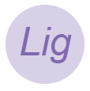

# Letter image generator  


Simple letter image generator. 

## 📖 Description

It uses a canvas to generate an image binary, 
according to the following characteristics:

- Random colors in images and letters
- *Required entries*: 
  - One or multiple letters, case sensitive 
  - Size (px)
- Font customization:
  - Font styles: 
    - normal (*default*), 
    - italic 
    - oblique
  - Font variant: 
    - normal (*default*)
    - small-caps 
  - Font weight: 
    - normal (*default*)
    - bold 
    - bolder
    - lighter 
    - 100, 200, 300, 400, 500, 600, 700, 800, 900
  - Font family: 
    - Arial (*default*) 
    - Courier New 
    - Cursive 
    - Fantasy 
    - Garamond 
    - Georgia 
    - sans-serif 
    - Tahoma 
    - Times New Roman 
    - Trebuchet MS 
    - Verdana 

## 📦 Installation

To install the package, just execute the following command:

`$ npm install letter-image-generator`

## 🕹️ Usage 
### Import
```
    import generateLetterImage from "letter-image-generator";
```

### Create image

Default

```
    //Creates an image with the specified letter/s and size in px, default font style, variant, weight and font values
    const img = generateLetterImage('L', 100);
```

Custom
```
    //Creates an image with the specified letter/s and size in px, custom font style, variant, weight and font values
    const img = generateLetterImage('Lig', 100, 'italic', 'small-caps', 'bold', 'Georgia');
```

### Usage Example 

```
    <html>
    
        <body>
          
        </body>
        
        <script type="module">     
        
            //1. Import      
            import generateLetterImage from "letter-image-generator";
            
            //2. Generate
            // default: const img = generateLetterImage('L', 100);
            // custom:
            const img = generateLetterImage('Lig', 100, 'italic', 'normal', 'lighter', 'sans-serif');
            
            //3. Use
            document.querySelector('#example').src = img;
            
        </script>
        
    </html>
    
```

Code output:   
